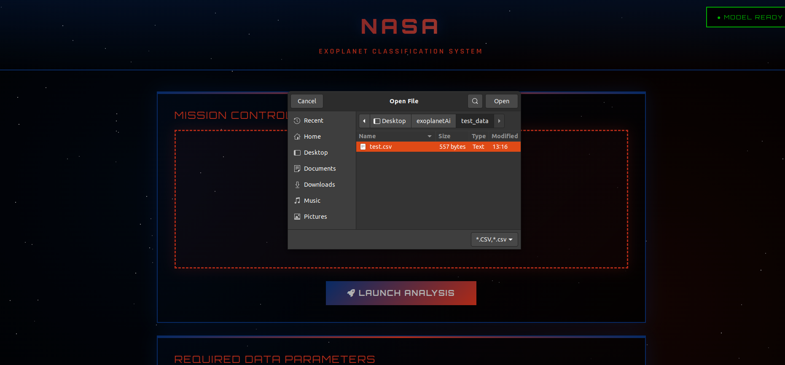

# ExoplanetAI

Website: https://exoplanetai.onrender.com/



## Problem

Currently, much of exoplanet candidate vetting is performed manually by NASA scientists and researchers. That manual review is time-consuming and doesn't scale well as survey missions collect ever larger volumes of data. This project aims to help by automating the first-pass classification of candidates so experts can focus on the most promising leads.

## Challenge objective

- Train an ML model (using Kepler/K2/TESS data) to classify exoplanet candidates as CONFIRMED, CANDIDATE, or FALSE.
- Provide a simple web interface to upload CSV data and see predictions and confidence scores.
- Use reproducible preprocessing (handle missing values, save preprocessing artifacts) so inference matches training.
- Make results downloadable and expose a small API for programmatic use.

Required CSV header:

```
koi_score,koi_depth,koi_model_snr,koi_period,koi_duration,koi_prad,koi_srad,koi_kepmag,koi_teq
```

Example row:
```
1.0,1288.3,87.2,9.27358173,3.2875,2.47,0.696,15.302,649.0
```

## How it works (simple)

- Train once: `model_trainer.py` learns from past labeled data and saves the model in `models/`.
- Webapp loads the saved model (now in background) and serves the upload UI.
- When you upload a CSV the app:
	1. Checks the required columns are present.
	2. Fills any missing numbers with column medians.
	3. Sends rows to the RandomForest model which combines many decision trees.
- The app shows:
	- Prediction label (CONFIRMED / CANDIDATE / FALSE)
	- Confidence (top probability, e.g. 96.7%)
	- Per-class probabilities (they add up to 100%)

Example output for the sample row above:
```
Prediction: CANDIDATE
Confidence: 96%
Probabilities: {CANDIDATE: 0.96, CONFIRMED: 0.03, FALSE: 0.01}
```


Output: Prediction label, Confidence (%), per-class probabilities.
